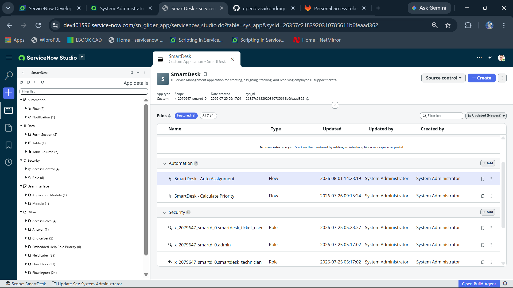
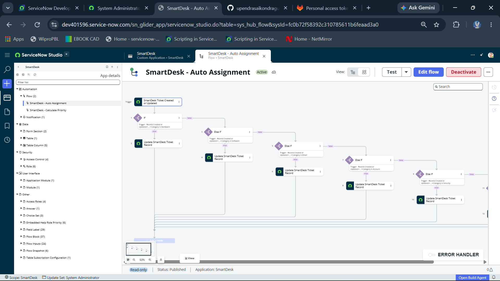
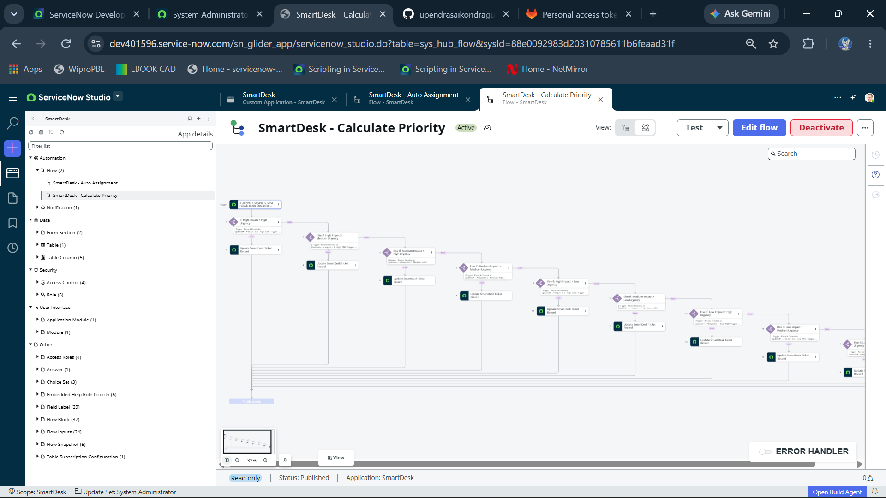
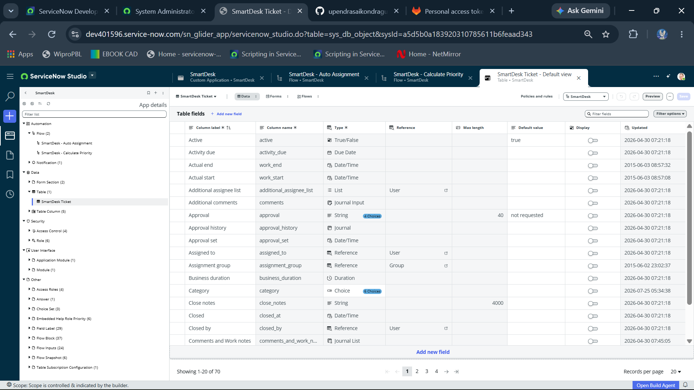
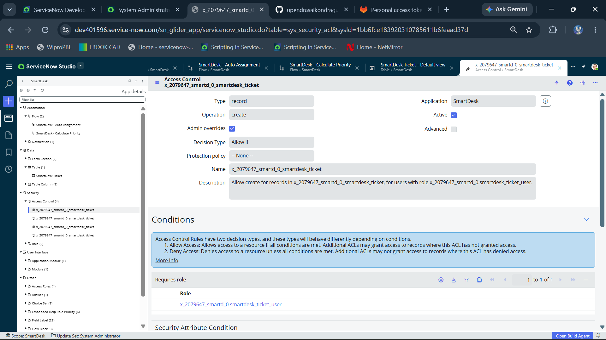

# SmartDesk

A custom ServiceNow application for creating, assigning, tracking, and resolving employee IT support tickets.

## Features

- Create and manage IT support tickets
- Automatic ticket assignment based on category
- Automatic priority calculation based on impact and urgency
- Role-based access using ServiceNow roles and ACLs

## ServiceNow Components

- Custom SmartDesk application
- SmartDesk Ticket table
- Custom table columns
- Application roles
- Access Controls (ACLs)
- Application module
- Module
- Flow Designer flows

## Automation

The application contains the following Flow Designer flows:

- SmartDesk - Auto Assignment
- SmartDesk - Calculate Priority

## Application

- Application: SmartDesk
- Version: 1.0.0
- Scope: x_2079647_smartd_0

## Source Control

The SmartDesk application is connected to a GitLab repository using ServiceNow Source Control.

- GitLab Repository: https://gitlab.com/upendrasaikondragunta/smartdesk-servicenow.git
- Source Control: GitLab
- Branch: sn_instances/dev401596

## Platform

- ServiceNow
- ServiceNow Studio
- Flow Designer
- GitLab

## Project Screenshots

### SmartDesk Application Overview

### Automatic Ticket Assignment

### Automatic Priority Calculation

### SmartDesk Ticket Table

### Access Control

## Author

Upendra Sai Chowdary
